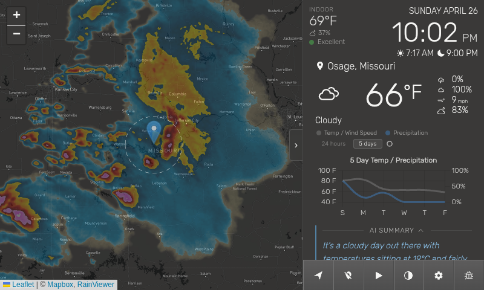
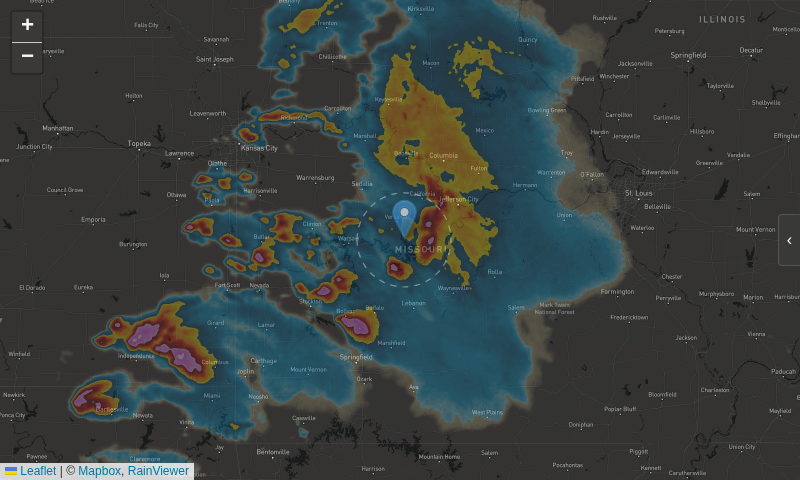
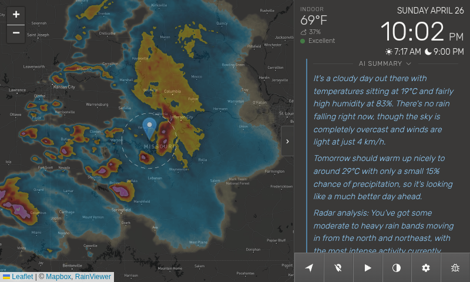
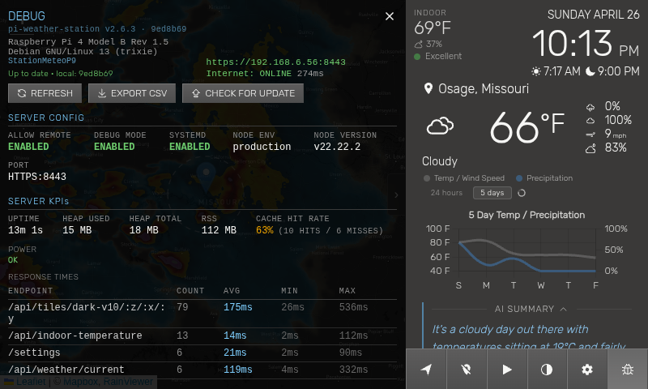
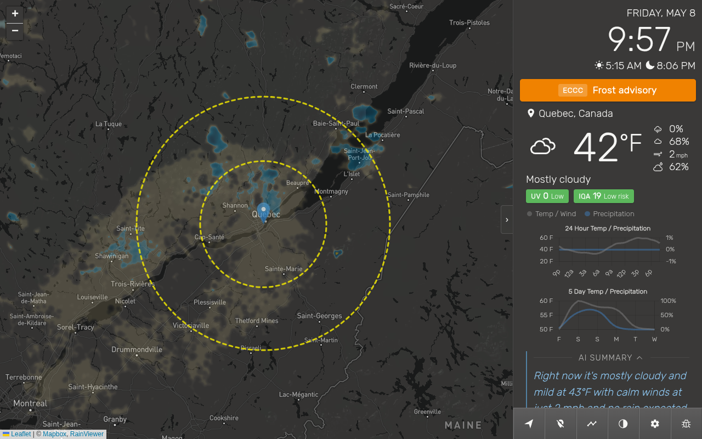
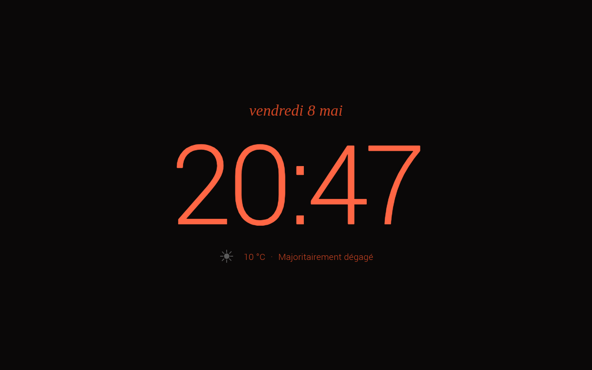

# Pi Weather Station

A full-stack weather display application originally designed for the Raspberry Pi 7" touchscreen, and confirmed to run on any modern Linux system (Debian, Ubuntu) or macOS.

| Platform | Auto-start | Kiosk mode |
|---|---|---|
| Raspberry Pi OS (Bullseye / Bookworm / Trixie) | systemd + labwc / wayfire / LXDE autostart | Chromium-family or Firefox |
| Debian / Ubuntu (incl. 26.04 GNOME, snap-Firefox) | systemd + XDG `~/.config/autostart` | Chromium-family or Firefox |
| openSUSE Leap 16+ (KDE Plasma) | systemd + XDG `~/.config/autostart` | Chromium-family or Firefox |
| macOS | launchd | — (window mode) |

The kiosk browser is chosen interactively by `install.sh` (Chromium, Chrome, Brave, Edge, or Firefox) and persisted in `~/.config/pi-weather-station/browser.conf`. Snap-confined Firefox is supported via a named profile (`-P pi-weather-station`).

## Screenshots

The original Pi Weather Station (v1.x), as designed by [@elewin](https://github.com/elewin):


The current v2 layout — indoor temperature/humidity/air-quality block, AI-generated weather summary with radar movement analysis, severe-weather alert banner fed by both the radar tier and government feeds (NWS + ECCC), color-coded UV and AQI badges chained across multiple government sources (MELCC, AirNow, OpenAQ, ECCC AQHI), user-selectable light/dark map styles, hardware screen-brightness control on supported displays, opt-in sleep mode / screensaver with melatonin-friendly red night palette, small-screen panel toggle, and a localhost-only debug panel:

| | |
|---|---|
|  |  |
| **Full layout (7" Pi)** — InfoPanel header shows the Homebridge-backed indoor temperature/humidity/air quality next to the clock; the dashed circle on the map is the 45 km radar-analysis zone fed to the AI summary. | **Radar full-width** — On screens ≤ 520 px tall, the floating chevron collapses the InfoPanel so the radar takes the full viewport. |
|  |  |
| **AI summary expanded** — Tapping the chevron hides the charts and slides the summary up; the third paragraph (`Radar analysis:`) describes precipitation movement around the user, sampled from RainViewer tiles server-side. | **Debug panel** — Localhost-only, enabled with `DEBUG=true`. Server config, KPIs (uptime, heap, cache hit rate), per-endpoint response times, provider status, quota counters, security events, and logs. |
|  |  |
| **Severe-weather alert + extended radar (10" Pi)** — Government alert banner pulled from ECCC (or NWS in the US) shown above the current conditions, here a frost advisory for Quebec. The map's two dashed circles mark the 50 km / 100 km radar-analysis zones (extended radius is on); UV index and air-quality (AQHI) badges sit under the wind/precipitation row, colour-coded by tier. | **Sleep mode (night-red variant)** — Opt-in screensaver fading in after configurable inactivity. Three colour palettes: day cream, night cream, and the night-red shown here — long-wavelength red has minimal impact on melatonin, friendlier for a kiosk visible from a bedroom or hallway. After a further delay, stage 2 fades to a black screen with a single moving dot to prevent LCD burn-in. |

The weather station will require you to have API keys from [Mapbox](https://www.mapbox.com/) and [Tomorrow.io](https://www.tomorrow.io/). Optionally, you can use an API key from [LocationIQ](https://locationiq.com/) to perform reverse geocoding, an [Anthropic](https://console.anthropic.com/) API key for AI-generated weather summaries powered by Claude, an [EPA AirNow](https://docs.airnowapi.org/account/request/) API key for US air-quality coverage, and an [OpenAQ](https://explore.openaq.org/register) API key as a global air-quality fallback. All four optional keys can be left empty — the air-quality block falls back to MELCC RSQA / RSQAQ / ECCC AQHI for Quebec and Canada-wide coverage, and the AI summary simply hides itself when no Anthropic key is configured. All API keys are kept server-side: they never appear in client-side request URLs, and remote clients only receive a masked response (boolean) from `GET /settings` — the actual key values are only accessible from the host itself.

Weather maps are provided by the [RainViewer](https://www.rainviewer.com/) API, which generously does not require an [API key](https://www.rainviewer.com/api.html).

Sunrise and Sunset times are provided by [Sunrise-Sunset](https://sunrise-sunset.org/), which generously does not require an [API key](https://sunrise-sunset.org/api).

Default geolocation (used when no custom coordinates are configured) is provided by [ipapi.co](https://ipapi.co/), which does not require an API key for basic usage.

See it in action [here](https://www.youtube.com/watch?v=dvM6cyqYSw8).

> Be mindful of the plan limits for your API keys and understand the terms of each provider, as scrolling around the map and selecting different locations will incur API calls for every location. Additionally, the weather station will periodically make additional API calls to get weather updates throughout the day. All weather (Tomorrow.io), map tile (Mapbox), reverse geocoding (LocationIQ), AI summary (Anthropic), and air-quality (AirNow / OpenAQ) calls are proxied through the server — multiple browser clients share the same quota rather than each consuming it independently. Weather responses are cached server-side, further reducing API usage.

## Updating

For day-to-day updates, the in-app **Update** button (debug panel → notification badge) handles `git pull`, `npm ci`, and the service restart automatically. If your installed version is too old for the in-app updater to handle (released before the updater learned to run `npm install`), the modal detects it and shows a one-time `bash deploy/install.sh` recipe to bootstrap before normal updates resume.

# Version history

See [CHANGELOG.md](./CHANGELOG.md) for full release notes per version, and the
[GitHub Releases](https://github.com/thicla01/pi-weather-station/releases) page
for tagged releases.

> **v1 → v2 note:** v2 switched from the ClimaCell API to Tomorrow.io after
> ClimaCell rebranded to Tomorrow.io in late 2020 and retired its v3 API
> shortly after. The historical
> [Pi Weather Station v1](https://github.com/elewin/pi-weather-station/releases/tag/v1.0)
> tag remains available as an archive of the original upstream fork by
> [@elewin](https://github.com/elewin), but **its weather calls no longer
> respond** — the v3 endpoints have been shut down for years, so v1 starts
> up but never gets data. Use v2 (this branch).

# Setup

> **Node.js requirement:** Node.js 18 or later is required. `install.sh` installs Node.js 22 on all supported platforms — via [nvm](https://github.com/nvm-sh/nvm) on Bullseye 32-bit (`armv7l`, where NodeSource has no packages), and via NodeSource on Bullseye 64-bit (`aarch64`), Bookworm (Debian 12), and Trixie (Debian 13).

> **API keys:** If you use the automated install (Option 1), the script will offer to configure your API keys automatically. For a manual setup, copy the example settings file and edit it:

    $ cp settings.example.json settings.json

To test the installation manually:

    $ npm install
    $ cd client && npm install && npm run prod && cd ..
    $ npm start

Now point your browser to `https://localhost:8443` and put it in full screen mode (`F11` in Chromium).

> **Note:** The server uses a self-signed SSL certificate generated automatically on first launch. Your browser will show a security warning — this is expected. You can safely accept the exception for `localhost`. To replace the self-signed cert with one from your own CA (Let's Encrypt, corporate CA, mkcert, etc.), see [docs/ssl-custom-cert_en.md](docs/ssl-custom-cert_en.md) (or the French version, [ssl-custom-cert_fr.md](docs/ssl-custom-cert_fr.md)).

## Running on startup

Three options are available in the `deploy/` folder. **Option 1 is recommended** for most users.

> **Which display server am I using?** Run the following command to find out:
> ```bash
> ps aux | grep -E 'labwc|wayfire|Xorg' | grep -v grep
> ```
> - `labwc` → Wayland with labwc (default on Trixie/Debian 13)
> - `wayfire` → Wayland with wayfire (default on Bookworm/Debian 12)
> - `Xorg` → X11 (default on Bullseye/Debian 11)

### Option 1 — Automated installation (recommended)

The `deploy/install.sh` script handles the full installation automatically:

```bash
git clone https://github.com/thicla01/pi-weather-station.git
cd pi-weather-station
bash deploy/install.sh
```

It will:
- Check for Node.js (v18 minimum) and offer to install Node.js 22 if missing or outdated — via nvm on Bullseye 32-bit, via NodeSource on all other platforms
- Optionally configure your API keys and create `settings.json`
- Optionally enable remote access from other machines on the network (see [Access from another machine](#access-from-another-machine))
- Optionally enable the debug panel (see [Debug panel](#debug-panel))
- Install server dependencies (`npm ci`); the React bundle ships pre-built in `client/dist/`, so the client only rebuilds if `--rebuild-client` is passed or `bundle.min.js` is missing
- Vulnerability scanning + automatic security PRs are handled by Dependabot on GitHub (see `.github/dependabot.yml`); merged PRs propagate to every Pi via the in-app updater's `npm ci`
- Configure and start the systemd service with log redirection to `/tmp/weather-server.log`
- Install log rotation (`/etc/logrotate.d/weather-server`) — daily rotation, 7 days history, max 10 MB, compressed
- Optionally enable kiosk mode — deploy `~/.local/bin/start-server` and configure your display server's autostart to launch Chromium in fullscreen automatically (default: yes). When declined, the server still starts via systemd but no autostart is configured
- Offer to reboot to launch the application automatically (default: yes)

Each prompt shows the default choice in uppercase — pressing Enter accepts the default.

### Option 2 — systemd (manual)

Starts the server automatically at boot, independent of the graphical session. Restarts automatically on failure.

```bash
git clone https://github.com/thicla01/pi-weather-station.git
cd pi-weather-station
cp deploy/pi-weather-server.service ~/.config/systemd/user/
npm install
cd client && npm install && npm run prod && cd ..
mkdir -p ~/.config/systemd/user/pi-weather-server.service.d
cat > ~/.config/systemd/user/pi-weather-server.service.d/override.conf << 'EOF'
[Service]
StandardOutput=append:/tmp/weather-server.log
StandardError=append:/tmp/weather-server.log
EOF
sudo cp deploy/logrotate-weather-server /etc/logrotate.d/weather-server
systemctl --user daemon-reload
systemctl --user enable pi-weather-server
systemctl --user start pi-weather-server
loginctl enable-linger $USER
mkdir -p ~/.local/bin
cp deploy/start-server ~/.local/bin/start-server
chmod +x ~/.local/bin/start-server
```

> **Bullseye 32-bit with nvm:** If you installed Node.js via nvm (see Node.js requirement above), systemd does not load the shell profile where nvm is initialized. Create an additional drop-in to source nvm explicitly — replace `~/.config/nvm` with `~/.nvm` if that is where nvm was installed:
> ```bash
> cat > ~/.config/systemd/user/pi-weather-server.service.d/nvm.conf << 'EOF'
> [Service]
> ExecStart=
> ExecStart=/bin/bash -c '. $HOME/.config/nvm/nvm.sh && exec npm start'
> EOF
> systemctl --user daemon-reload
> ```

Then configure your display server's autostart to launch `start-server`. This script waits for the server to be ready, automatically detects whether it started on port 8443 (HTTPS) or 8080 (HTTP), and automatically detects the Chromium binary (`chromium` on Bookworm/Trixie, `chromium-browser` on Bullseye).

**labwc** (default on Trixie/Debian 13):

```bash
cp deploy/autostart ~/.config/labwc/autostart
```

**wayfire** (default on Bookworm/Debian 12) — add to `~/.config/wayfire.ini` under the `[autostart]` section:

```ini
[autostart]
start-server = start-server
```

**X11/LXDE** (default on Bullseye/Debian 11) — if `~/.config/lxsession/LXDE-pi/autostart` does not exist yet, copy the system default first to preserve the desktop entries, then append `start-server`:

```bash
[ ! -f ~/.config/lxsession/LXDE-pi/autostart ] && \
  cp /etc/xdg/lxsession/LXDE-pi/autostart ~/.config/lxsession/LXDE-pi/autostart
echo "@start-server" >> ~/.config/lxsession/LXDE-pi/autostart
```

View logs with:

```bash
tail -f /tmp/weather-server.log
```

Then reboot to launch the application automatically:

```bash
sudo reboot
```

### Option 3 — autostart script (without systemd)

Copy the provided script to `~/.local/bin/` and call it from your compositor's autostart:

```bash
mkdir -p ~/.local/bin
cp deploy/start-weather ~/.local/bin/start-weather
chmod +x ~/.local/bin/start-weather
sudo cp deploy/logrotate-weather-server /etc/logrotate.d/weather-server
```

This script starts the Node.js server, waits for it to be ready, automatically detects whether it started on port 8443 (HTTPS) or 8080 (HTTP), and automatically detects the Chromium binary (`chromium` on Bookworm/Trixie, `chromium-browser` on Bullseye).

**labwc** (default on Trixie/Debian 13) — add to `~/.config/labwc/autostart`:

```bash
start-weather &
```

**wayfire** (default on Bookworm/Debian 12) — add to `~/.config/wayfire.ini` under the `[autostart]` section:

```ini
[autostart]
weather = start-weather
```

**X11/LXDE** (default on Bullseye/Debian 11) — if `~/.config/lxsession/LXDE-pi/autostart` does not exist yet, copy the system default first to preserve the desktop entries, then append `start-weather`:

```bash
[ ! -f ~/.config/lxsession/LXDE-pi/autostart ] && \
  cp /etc/xdg/lxsession/LXDE-pi/autostart ~/.config/lxsession/LXDE-pi/autostart
echo "@start-weather" >> ~/.config/lxsession/LXDE-pi/autostart
```

View logs with:

```bash
tail -f /tmp/weather-server.log
```

Then reboot to launch the application automatically:

```bash
sudo reboot
```

## Sense HAT LED display (optional)

If your Raspberry Pi has a [Sense HAT](https://www.raspberrypi.com/products/sense-hat/) attached, the included display script shows animated weather states on the 8×8 RGB LED matrix.

**Features:**
- 12 weather states: clear day/night, partly cloudy day/night, overcast, fog, light rain, rain, snow, ice pellets, thunderstorm
- Sun travels an east-to-west arc throughout the day, shifting from yellow at noon to red near the horizon
- Sunset glow (4 red pixels) appears on the horizon as the sun sets
- Brightness automatically reduced at night

**Installation:**

The `deploy/install.sh` script asks whether a Sense HAT is present and handles the setup automatically. For a manual install:

```bash
sudo apt-get install sense-hat
cp deploy/pi-sensehat.service ~/.config/systemd/user/
systemctl --user enable --now pi-sensehat
```

**Test mode** — cycles through all 12 states for 15 seconds each:

```bash
python3 ~/pi-weather-station/tools/sensehat_weather.py --test
```

**View logs:**

```bash
journalctl --user -u pi-sensehat -n 50
```

> **Important:** the script takes exclusive control of the Sense HAT LED matrix. Disable any other program writing to the HAT (clock display, demos, etc.) before enabling the service.

> **Orientation:** edit the `ROTATION` constant in `tools/sensehat_weather.py` if the display appears rotated. On a Pi 4B with USB-C/HDMI pointing up, use `ROTATION = 180`.

## Uninstall

To remove the Pi Weather Station service, scripts, and configurations:

```bash
bash deploy/uninstall.sh
```

The script will automatically remove the systemd service, `~/.local/bin/start-server`, `~/.local/bin/start-weather`, and the display server's autostart configuration. It will then ask whether to also remove:

- `settings.json` (contains your API keys) — kept by default
- SSL certificates (`server/cert.pem`, `server/key.pem`) — kept by default
- `node_modules` directories — removed by default
- The entire project directory — kept by default (requires explicit confirmation)

## Access from another machine

By default the server only accepts connections from `localhost` (127.0.0.1).

When remote access is enabled (`ALLOW_REMOTE=true`), the following applies:
- All upstream API calls are **proxied through the server** — keys are never visible in client-side request URLs or third-party server logs. Remote clients receive only a boolean (configured / not configured) from `GET /settings` — actual key values are never sent over the network. Proxied upstreams include: weather (Tomorrow.io), map tiles (Mapbox), reverse geocoding (LocationIQ), AI summary (Anthropic), air quality (EPA AirNow, OpenAQ, MELCC RSQA, RSQAQ, ECCC AQHI), severe-weather alerts (NWS for US, ECCC for Canada), radar tiles (RainViewer), sunrise/sunset (Sunrise-Sunset.org), and default geolocation (ipapi.co).
- Unit and display preferences (temperature, speed, clock format, etc.) work from any device.
- Settings writes (API keys, coordinates) are **always restricted to the Pi itself**. To change settings remotely, use an SSH tunnel instead (see below).

> **Changing settings remotely:** open an SSH tunnel and access the app as if you were local:
> ```bash
> ssh -L 8443:localhost:8443 pi@<pi-ip>
> # then open https://localhost:8443 in your browser
> ```

### Option 1 — Automated (recommended)

If you used `deploy/install.sh`, remote access can be configured automatically during installation. The script will:
- Ask for your Pi's IP address (auto-detected)
- Generate an SSL certificate that includes the Pi's IP as a Subject Alternative Name (SAN) — browsers will show a one-time security warning on first visit, which you can safely accept
- Enable `ALLOW_REMOTE=true` in the systemd service
- Remote users are always restricted to read-only access (settings writes are always localhost-only)

> **Toggling remote access after installation:** use `deploy/toggle-remote.sh` to flip the switch on or off without re-walking through the full install.sh flow. The script reads the current state, asks to confirm the inverse action, regenerates the SSL certificate with your LAN IP (when enabling), reloads the service manager, and restarts the server. Works on Linux (systemd) and macOS (launchd).
>
> ```bash
> bash deploy/toggle-remote.sh
> ```

> **Note:** If your Pi's IP address changes, the SSL certificate will no longer be valid for remote connections. Re-run `bash deploy/toggle-remote.sh` (or `bash deploy/install.sh`) to regenerate it. To avoid this, assign a static IP to your Pi.

### Option 2 — Manual

To allow access from other devices, set the `ALLOW_REMOTE=true` environment variable when starting the server.

**With systemd** — write a drop-in file so the upstream service file stays untouched (and future updates don't flag a "service file changed" warning):

```bash
mkdir -p ~/.config/systemd/user/pi-weather-server.service.d
cat > ~/.config/systemd/user/pi-weather-server.service.d/local.conf << 'EOF'
[Service]
Environment=ALLOW_REMOTE=true
EOF
systemctl --user daemon-reload
systemctl --user restart pi-weather-server
```

Or just run `bash deploy/toggle-remote.sh` which does the above plus regenerates the SSL certificate with your LAN IP as a Subject Alternative Name.

> Settings writes are always restricted to the Pi itself. To change settings remotely, use an SSH tunnel.

**With the autostart script** — edit `~/.local/bin/start-weather` and uncomment:

```bash
ALLOW_REMOTE=true /usr/bin/npm start &
```

**Manually:**

```bash
ALLOW_REMOTE=true npm start
```

The server will now serve the app across your network on port 8443 (HTTPS).

> **SSL certificate:** The auto-generated certificate only covers `localhost` and `127.0.0.1`. When accessing from another machine, your browser will show a certificate warning. To avoid this, regenerate the certificate with your Pi's IP as a SAN:
> ```bash
> openssl req -x509 -newkey rsa:2048 \
>     -keyout server/key.pem -out server/cert.pem \
>     -days 825 -nodes -subj "/CN=localhost" \
>     -addext "subjectAltName=DNS:localhost,IP:127.0.0.1,IP:<your-pi-ip>"
> chmod 600 server/key.pem
> ```
> Then restart the server.

## Debug panel

A debug panel is available on the Pi when `DEBUG=true` is set server-side. It shows:

- **Header** — application name, version, Git commit hash, and active branch (if not `master`); hardware model, OS version, network URL(s), and internet connectivity status (`ONLINE` / `OFFLINE` + latency)
- **Server KPIs** — process uptime, heap memory (used/total) and RSS, weather cache hit rate, and a per-endpoint response time table (count, avg, min, max)
- **Client KPIs** — page load time, live FPS, JS heap size (Chromium only), and a per-endpoint summary of all `/api/*` calls recorded by the browser since page load
- **Provider status** — live operational status fetched from each provider's status page (Tomorrow.io, Mapbox, ipapi.co, LocationIQ), cached 30 minutes
- **Services** — last HTTP status and timestamp for each external API call (Tomorrow.io, Mapbox, LocationIQ, ipapi.co, sunrise-sunset.org, Claude)
- **Quotas** — hourly, daily, and monthly request counters per service and endpoint, with colour-coded thresholds
- **Cache** — current in-memory weather cache entries with remaining TTL
- **Logs** — last 100 lines of the server log (`/tmp/weather-server.log` on Linux, `<repo>/server.log` on macOS — see [`docs/logs.md`](docs/logs.md) for why `journalctl` is not the place to look)
- **Security events** — blocked requests (write attempts from remote clients)
- **Vulnerability scan** — links to the repo's public list of dependency-related PRs on GitHub (open + closed, both security and weekly version updates), the public-facing equivalent of Dependabot's alerts dashboard since `npm audit` was retired from `install.sh`. The URL is built per-fork so a downstream fork lands on its own PR list automatically

The debug button (bug icon) appears in the control bar only when `DEBUG=true` and only when the app is accessed from the Pi itself.

> **Toggling debug mode after installation:** use `deploy/toggle-debug.sh` to flip the switch on or off without re-walking through the full install.sh flow. Reads the current state from the systemd drop-in (Linux) or the launchd plist (macOS), asks to confirm the inverse action, edits the env var, and reloads + restarts the service.
>
> ```bash
> bash deploy/toggle-debug.sh
> ```

**With systemd (Option 1 or 2)** — edit the override file and uncomment the `DEBUG=true` line:

```bash
nano ~/.config/systemd/user/pi-weather-server.service.d/override.conf
```

Remove the `#` in front of `# Environment=DEBUG=true`, then reload and restart:

```bash
systemctl --user daemon-reload
systemctl --user restart pi-weather-server
```

**With the autostart script (Option 3)** — edit `~/.local/bin/start-weather`:

```bash
nano ~/.local/bin/start-weather
```

Comment out the default `npm start` line and uncomment the `DEBUG=true` line:

```bash
# npm start >> /tmp/weather-server.log 2>&1 &
DEBUG=true npm start >> /tmp/weather-server.log 2>&1 &
```

**Manually:**

```bash
DEBUG=true npm start
```

> `DEBUG=true` is disabled by default. The `/api/debug` endpoint is always restricted to `localhost` regardless of this setting — it cannot be accessed from remote machines even when `ALLOW_REMOTE=true`.

# Environment variables

These variables are set in the systemd service drop-in (`~/.config/systemd/user/pi-weather-server.service.d/override.conf`) or exported before `npm start`.

| Variable | Values | Default | Description |
|---|---|:---:|---|
| `ALLOW_REMOTE` | `true` / `false` | `false` | Allow connections from other devices on the network. When `false`, the server only accepts connections from `localhost`. |
| `DEBUG` | `true` / `false` | `false` | Enable the debug panel and the `/api/debug` endpoint. Both remain restricted to localhost regardless of this flag. |

No other environment variables are used by the server. API keys and user preferences are stored in `settings.json`, not in the environment.

# Settings

- Your API keys are saved locally (in plain text) to `settings.json`.
- The server will attempt to get your default location via [ipapi.co](https://ipapi.co/) (requires internet access), but if it cannot or you wish to choose a different default location, enter the latitude and longitude under `Custom Latitude` and `Custom Longitude` in settings, which can be accessed by tapping the gear button in the lower right hand corner.
- To hide the mouse cursor when using a touch screen, set `Hide Mouse` to `On`.
- To adjust text size in the info panel, use the **Font Size** toggle (S / M / L). The setting is saved in `localStorage` and takes effect immediately.
- To enable AI weather summaries, enter your [Anthropic API key](https://console.anthropic.com/) in the `Anthropic API Key` field. This feature is optional — the app works fully without it. Summaries are generated by Claude Haiku, cached 15 minutes server-side, and adapt to the time of day (morning, evening, or night forecast in the second paragraph). Supported languages: English, French, Spanish. For the full local-vs-Anthropic data flow, caching layers, and model-upgrade procedure, see [docs/ai-summary.md](docs/ai-summary.md).

# Contributors

- [@elewin](https://github.com/elewin) — Original author. Tile-rendering fixes on both the Mapbox basemap and the RainViewer radar overlay (`tileSize=512` + `zoomOffset=-1` + `maxNativeZoom=8`) were cherry-picked from his upstream [PR #76](https://github.com/elewin/pi-weather-station/pull/76) and [PR #77](https://github.com/elewin/pi-weather-station/pull/77).
- [@aevans1987](https://github.com/aevans1987)
- [@dagent23](https://github.com/dagent23)
- [@klamer](https://github.com/klamer)
- [Claude Code](https://claude.ai/code) (Anthropic) — AI pair programmer

# License

The MIT License (MIT)

Copyright (c) 2020 Eric Lewin

Permission is hereby granted, free of charge, to any person obtaining a copy of this software and associated documentation files (the "Software"), to deal in the Software without restriction, including without limitation the rights to use, copy, modify, merge, publish, distribute, sublicense, and/or sell copies of the Software, and to permit persons to whom the Software is furnished to do so, subject to the following conditions:

The above copyright notice and this permission notice shall be included in all copies or substantial portions of the Software.

THE SOFTWARE IS PROVIDED "AS IS", WITHOUT WARRANTY OF ANY KIND, EXPRESS OR IMPLIED, INCLUDING BUT NOT LIMITED TO THE WARRANTIES OF MERCHANTABILITY, FITNESS FOR A PARTICULAR PURPOSE AND NONINFRINGEMENT. IN NO EVENT SHALL THE AUTHORS OR COPYRIGHT HOLDERS BE LIABLE FOR ANY CLAIM, DAMAGES OR OTHER LIABILITY, WHETHER IN AN ACTION OF CONTRACT, TORT OR OTHERWISE, ARISING FROM, OUT OF OR IN CONNECTION WITH THE SOFTWARE OR THE USE OR OTHER DEALINGS IN THE SOFTWARE.
