# Pi Weather Station

A full-stack weather display application originally designed for the Raspberry Pi 7" touchscreen, and confirmed to run on any modern Linux system (Debian, Ubuntu) or macOS.

| Platform | Auto-start | Kiosk mode |
|---|---|---|
| Raspberry Pi OS (Bullseye / Bookworm / Trixie) | systemd + labwc / wayfire / LXDE autostart | Chromium-family or Firefox |
| Debian / Ubuntu (incl. 26.04 GNOME, snap-Firefox) | systemd + XDG `~/.config/autostart` | Chromium-family or Firefox |
| openSUSE Leap 16+ (KDE Plasma) | systemd + XDG `~/.config/autostart` | Chromium-family or Firefox |
| macOS | launchd | — (window mode) |

The kiosk browser is chosen interactively by `install.sh` (Chromium, Chrome, Brave, Edge, or Firefox) and persisted in `~/.config/pi-weather-station/browser.conf`. Snap-confined Firefox is supported via a named profile (`-P pi-weather-station`); snap-packaged Brave is not — install Brave from its APT repository instead (see **Option 1** under [Running on startup](#running-on-startup)).

## 📣 Highlights — October 2026

Releases 3.3.0 and 3.3.1 just landed (full details in [CHANGELOG.md](./CHANGELOG.md) and on the [Releases](https://github.com/thicla01/pi-weather-station/releases) page).

**3.3.1: a smoother, lighter radar**

- **The radar timeline plays smoothly.** The frames around the one on screen now stay loaded, so playing or scrubbing the loop no longer blanks the map between frames, a stutter most visible on wide screens. Firefox, as a kiosk or a remote viewer, also stops re-blurring the moving radar under every overlay. Both ideas come from [@Aryeh95](https://github.com/Aryeh95)'s [Sweep](https://github.com/Aryeh95/Sweep) fork. Thank you!
- **One kiosk can no longer lock the others out of the radar.** RainViewer limits tile requests per public IP, so every kiosk behind the same router shares one budget. A refused radar tile is now held and retried after RainViewer's one-minute window, instead of being requested again on every loop pass, which had kept the whole network over the limit while a wide kiosk played the loop.
- **A lighter bundle.** Production builds no longer ship the CSS comments: 225 KB less (−11.5 %) for every kiosk and phone to download and parse.
- **Kiosk fixes.** The map stays centred after leaving the fullscreen radar on a slow Pi, dock toasts sit above the tapped button again, the 7" radar legend stays compact over the scrubber, and a brief weather-data gap no longer hides the AI summary.

**3.3.0**

- **The AI summary runs on Claude Haiku 5.5.** `claude-haiku-5-5` with adaptive thinking at low effort, at an estimated 25–30 % of the previous per-call cost (less still without the radar paragraph). A refused or empty reply is never cached, so the last summary stays on screen and the next poll retries. The AI view now opens from the dock on every Pi panel, the 10.1" kiosks included.
- **Places refinements.** Pinning the kiosk's own default location no longer costs a favorite slot (7 places when one of them is the default, 6 otherwise), renaming is no longer hidden on touchscreen kiosks (typing the name still takes a keyboard), and a `↺` in the Places popover returns the default location to IP geolocation without a trip to Settings. User guide: [`docs/places-guide_en.md`](docs/places-guide_en.md) ([FR](docs/places-guide_fr.md) · [ES](docs/places-guide_es.md)).
- **Security sweep.** The release's dependency alerts were all cleared — every one transitive, none with runtime exposure on the Pis, including a critical `proxy-addr` advisory under Express — and the Dependabot auto-merge safety net now catches transitive security fixes too.
- **Built with Claude.** The design references come from Claude Design; the implementation, the adversarial multi-agent reviews, the canary runs and the audits were carried out with [Claude Code](https://claude.com/claude-code) running Anthropic's **Opus 5, Opus 5.5, Fable 5 and Fable 5.1**.

## Interface

**v3 "Ambient Layers" is the interface** — a full rebuild of the dashboard, settings, and debug panels with a refreshed visual language. It became the default in **v2.18** (May 2026), and in **July 2026** the legacy v2 layout and the toggle that selected it were removed, after the field-test window closed with no v3-only regression reported.

There is nothing to switch. v3 picks its layout from the viewport on its own and reflows live as the window changes:

| Viewport | Layout |
|---|---|
| ≤ 799 px wide | Phone — single scrollable column, mini radar with a maximize button, pull-to-refresh |
| 800-1279 px wide | Pi kiosk (7" / 10") — 2-column grid, radar plus an information rail |
| ≥ 1280 px wide | Desktop — full-bleed map with floating panels |

Full layout reference: [`docs/ui-layout_en.md`](docs/ui-layout_en.md) (French: [`docs/ui-layout_fr.md`](docs/ui-layout_fr.md)). If you are reading older screenshots or release notes and want the v2 layout for reference, it is archived in [`docs/archive/ui-layout_v2_en.md`](docs/archive/ui-layout_v2_en.md).

Hit a bug, a regression, or an awkward layout? Please open an issue at <https://github.com/thicla01/pi-weather-station/issues>.

## Screenshots

Every v3 capture below is the **same location at the same hour** — Mont Belvieu, Texas, under an NWS Tropical Storm Warning with a convective line crossing the 30 mi analysis ring. The layouts can therefore be compared against each other rather than against different weather. Units are imperial and the clock is 12 h, both user preferences.

### The three layouts

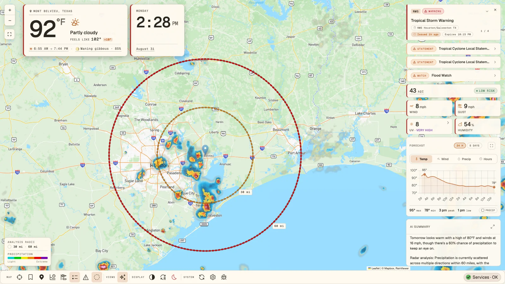

**Desktop (≥ 1280 px)** — Full-bleed radar with floating panels: the hero card (place, temperature, condition, feels-like, sunrise/sunset + moon meta-line), the clock card, and on the right the alert stack — an NWS **Tropical Storm Warning** with its source badge, issuing office, issue/expiry chips and a `1 / 4` cycle indicator, with two Tropical Cyclone Local Statements and a Flood Watch folded beneath it — followed by the AQI card, the wind / gust / UV / humidity tiles, the forecast card, and the Claude summary with its radar-movement paragraph. The dashed rings mark the 30 / 60 mi radar-analysis zones — the imperial twin of the metric 50 / 100 km, following the distance-unit preference.

| Pi kiosk, 7" official screen (800×480) | Pi kiosk, 10" screen (1024×600) |
|---|---|
| [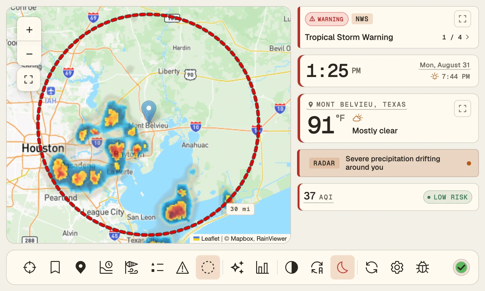](docs/screenshots/v3-pi7-day.webp) | [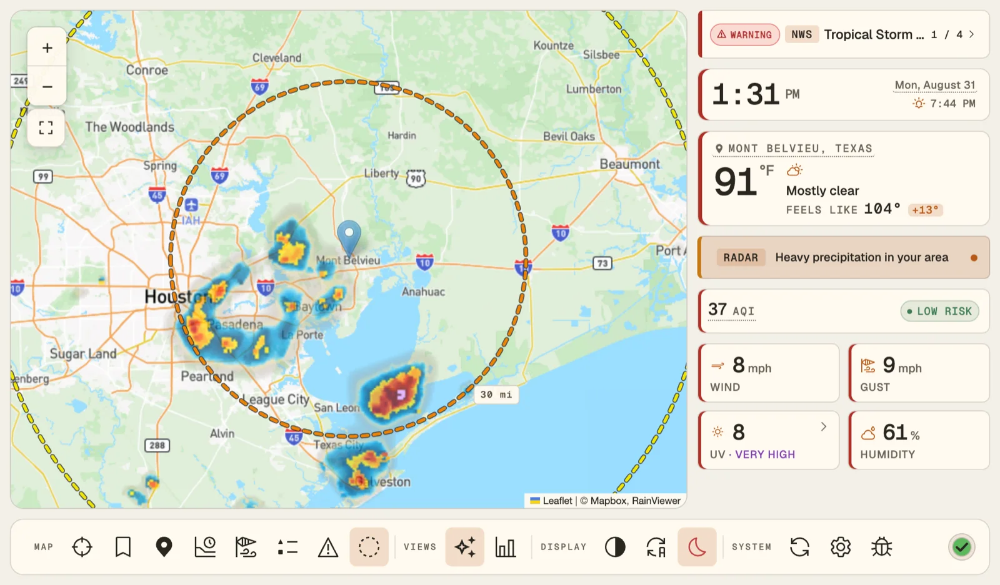](docs/screenshots/v3-pi10-day.webp) |
| The lean radar-companion rail — alert, clock, hero, the locally-derived `RADAR` banner, air quality. The forecast and the AI prose are one dock tap away rather than in this glance. | The same layout with the vertical room for the full metrics grid: wind, gust, UV, humidity. |

| Phone (< 800 px) | Night-vision red palette |
|---|---|
| [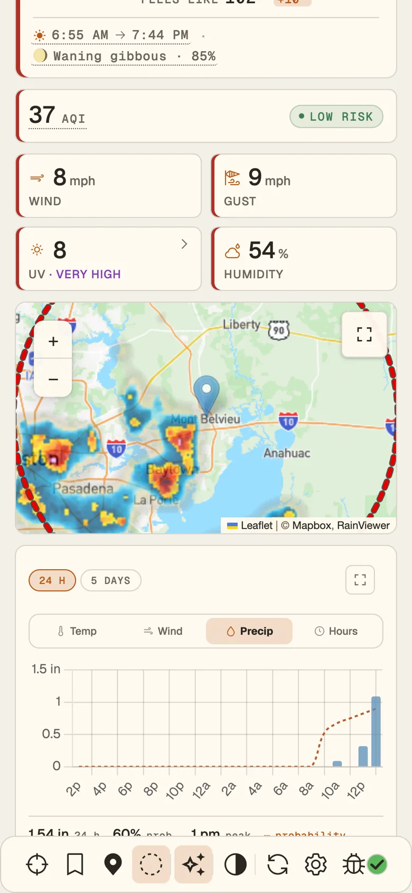](docs/screenshots/v3-phone-radar.webp) | [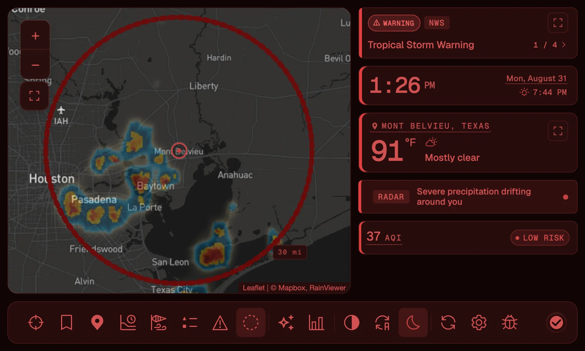](docs/screenshots/v3-pi7-nightred.webp) |
| A single scrollable column, scrolled here to the mini radar card and its maximize button, with the precipitation forecast below. | `nightRed` — the melatonin-friendly palette for a bedroom or hallway kiosk. Radar intensity keeps its own colours so the map stays readable. |

The dark **dusk** palette (used whenever dark mode is on and the night-vision red palette is off) is [`v3-desktop-dusk.webp`](docs/screenshots/v3-desktop-dusk.webp).

### What the station shows

- **Indoor sensors block** — temperature / humidity / air quality from Homebridge, shown with the outdoor metrics, under the metrics grid.
- **AI-generated weather summary** powered by Claude, with a radar-movement paragraph describing nearby precipitation.
- **Severe-weather alert banner** — fed by NWS (US) and ECCC (Canada) plus a local radar-derived tier. Every banner carries a leading `RADAR` / `ECCC` / `NWS` source badge so the origin is unambiguous; RADAR banners get an optional confidence pill (green / amber / red), and a tap cycles through multiple active government alerts.
- **Gov-alert detail section** — collapsible block under the banner with the alert's full description and a QR code that opens the upstream alerts page on the user's phone (kiosk-safe: no risk of getting trapped on an external page).
- **Direction-arrow overlay** on the map (optional, toggled from a button in the bottom dock; needs the radar analysis rings on) — shows per-bearing motion of nearby precipitation bands.
- **Air quality and UV** — the air card shows the closest air-quality station across MELCC (Quebec), AirNow (US) and OpenAQ (global), with ECCC AQHI as the Canada-wide fallback, plus an optional pollen row (Open-Meteo); UV comes from Tomorrow.io's current conditions, as a tile in the metrics grid.
- **Light / dark map styles**, user-selectable from settings.
- **Hardware screen-brightness control** on supported displays.
- **Opt-in sleep mode / screensaver** with a melatonin-friendly red night palette.
- **Focus-radar toggle** — a small button under the map's zoom controls hides the hero and the information rail so the radar fills the viewport; tap again to bring them back. Available on the Pi kiosk and desktop layouts (the phone layout has its own maximize button on the mini radar).
- **Radar timeline** — scrub or play through the past two hours of RainViewer frames, plus its nowcast when RainViewer serves one (it has served none since October 2026), at 1× / 2× / 4× speed with a touch-friendly transport bar; hiding the bar always snaps the radar back to "now".
- **Favorite locations** — pin up to 6 places (7 when one is the kiosk's own default), jump back to them from the Places popover in the dock, and promote one as the default location.
- **Localhost-only debug panel** with KPIs, service status, quota counters, radar snapshots, and logs.

### Feature close-ups

| | |
|---|---|
| [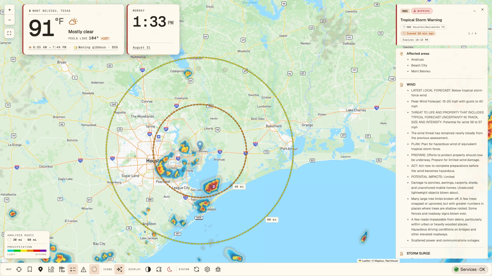](docs/screenshots/v3-alert-detail.webp) | [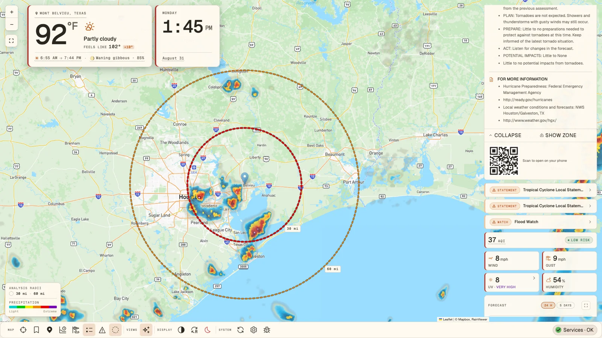](docs/screenshots/v3-alert-qr.webp) |
| **Gov-alert detail** — the collapsible block under the banner, with affected areas and the upstream text split into its WIND / STORM SURGE sections. | **QR, never a link** — the kiosk has no browser chrome to get back from, so the upstream page is offered as a QR code to scan with a phone. |
| [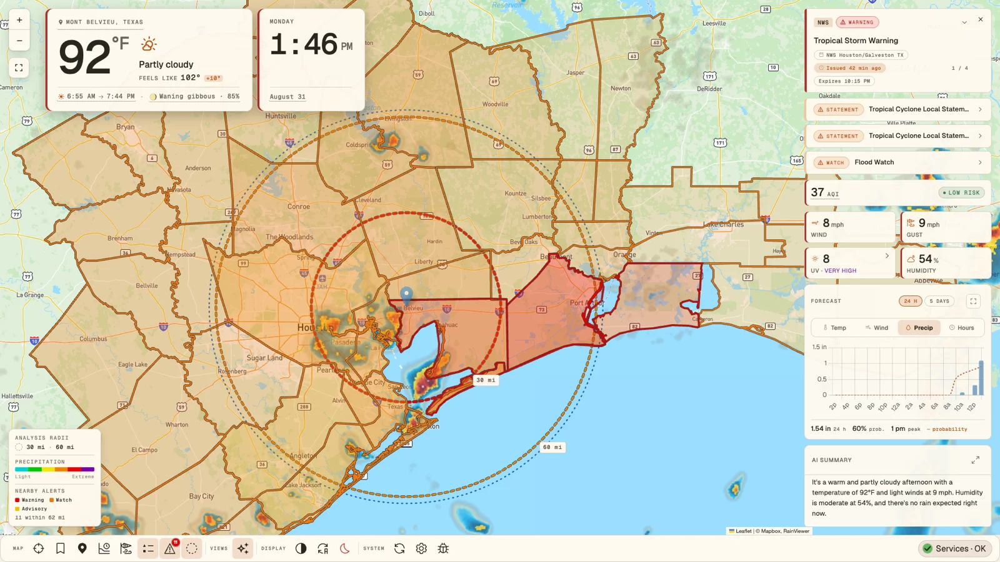](docs/screenshots/v3-alerts-overlay.webp) | [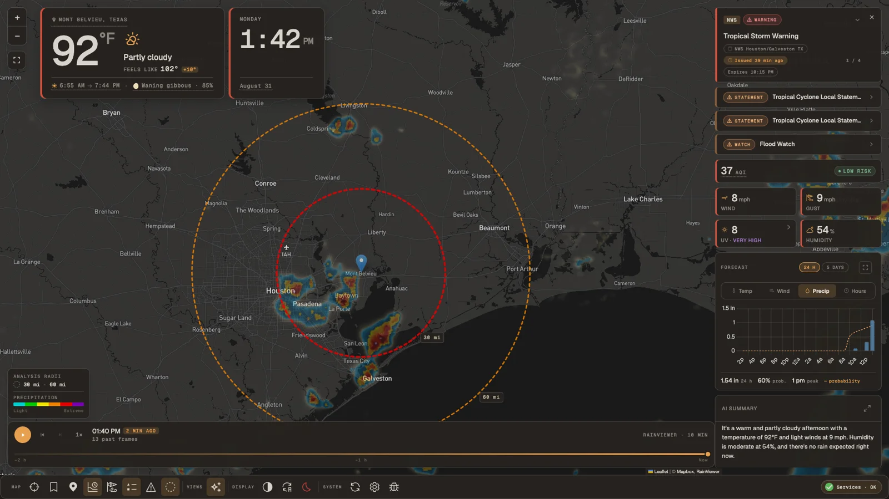](docs/screenshots/v3-radar-timeline.webp) |
| **Nearby-alert overlay** — every active polygon around you, tinted by severity, with a count in the legend and a badge on the dock button. | **Radar timeline** — scrub or play the past frames and the nowcast, with a labelled "Now" marker at the boundary and a hatched future zone (shown when RainViewer serves a nowcast; it has served none since October 2026). |
| [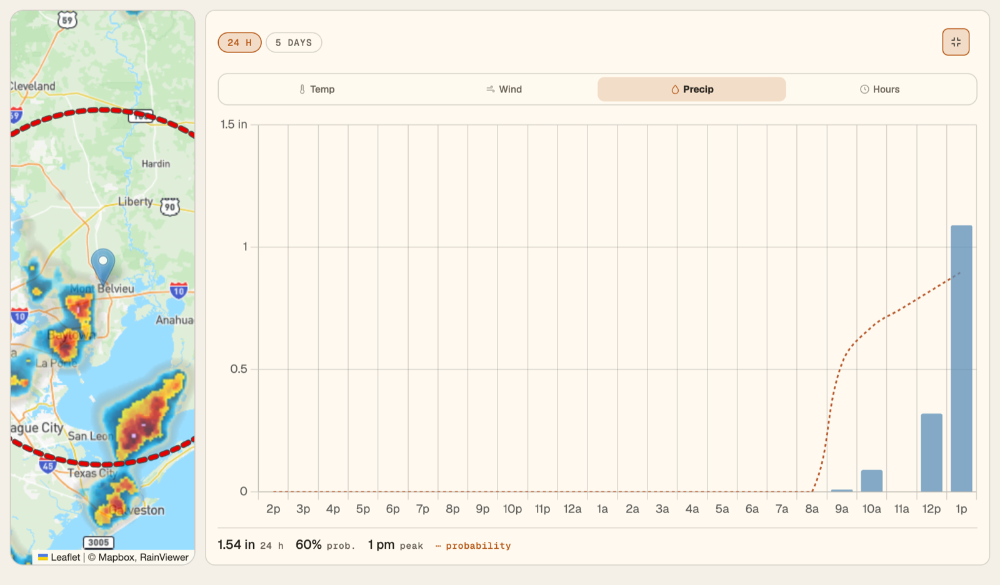](docs/screenshots/v3-forecast-max.webp) | [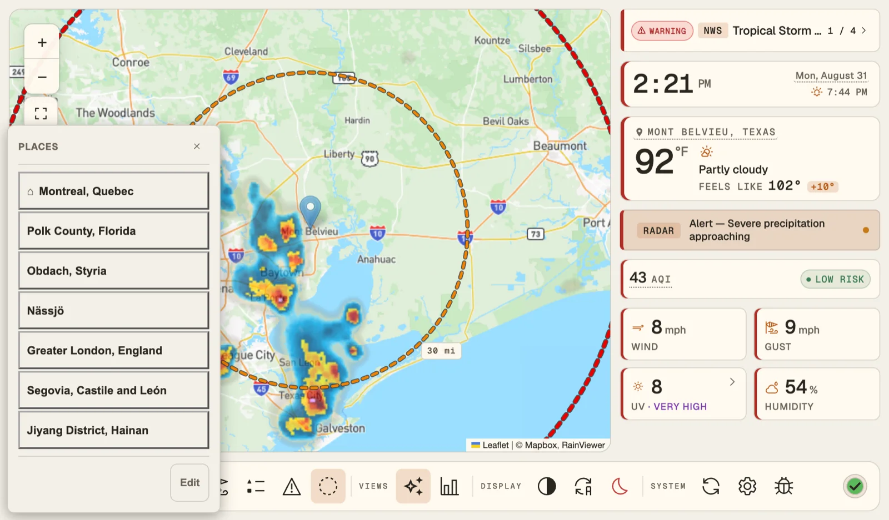](docs/screenshots/v3-places.webp) |
| **Forecast, maximized** — the map shrinks to a thumbnail and the chart takes the full rail; here the precipitation tab, hourly bars plus the probability curve. | **Favorite locations** — the home row on top, then the pinned places; this is the full budget of seven rows. |
| [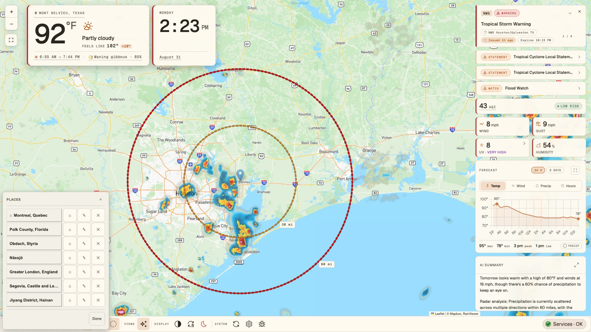](docs/screenshots/v3-places-edit.webp) | [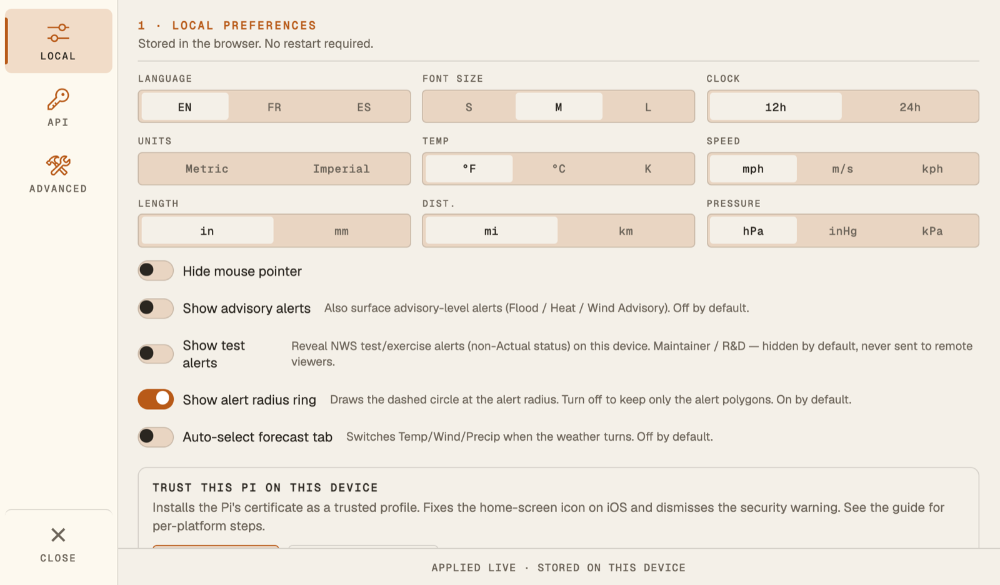](docs/screenshots/v3-settings.webp) |
| **Places, edit mode** — per row: set as default, rename, remove. | **Settings** — local preferences applied live and stored per device; API keys and advanced options sit behind the rail. |

The localhost-only debug panel, on its services bucket — provider status pages, recent calls with their status codes, and the per-endpoint quota counters:

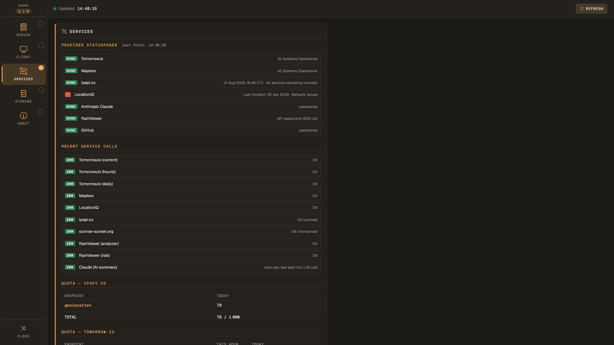

### Where this started

The original Pi Weather Station (v1.x), as designed by [@elewin](https://github.com/elewin):


> The v2-era gallery lives on in the git history, and the v2 layout reference remains archived in [`docs/archive/ui-layout_v2_en.md`](docs/archive/ui-layout_v2_en.md).


The weather station will require you to have API keys from [Mapbox](https://www.mapbox.com/) and [Tomorrow.io](https://www.tomorrow.io/). Optionally, you can use an API key from [LocationIQ](https://locationiq.com/) to perform reverse geocoding, an [Anthropic](https://console.anthropic.com/) API key for AI-generated weather summaries powered by Claude, an [EPA AirNow](https://docs.airnowapi.org/account/request/) API key for US air-quality coverage, and an [OpenAQ](https://explore.openaq.org/register) API key as a global air-quality fallback. All four optional keys can be left empty — the air-quality block falls back to MELCC RSQA / RSQAQ / ECCC AQHI for Quebec and Canada-wide coverage, and the AI summary simply hides itself when no Anthropic key is configured. All API keys are kept server-side: they never appear in client-side request URLs, and remote clients only receive a masked response (boolean) from `GET /settings` — the actual key values are only accessible from the host itself.

Weather maps are provided by the [RainViewer](https://www.rainviewer.com/) API, which generously does not require an [API key](https://www.rainviewer.com/api.html).

Sunrise and Sunset times are provided by [Sunrise-Sunset](https://sunrise-sunset.org/), which generously does not require an [API key](https://sunrise-sunset.org/api).

Default geolocation (used when no custom coordinates are configured) is provided by [ipapi.co](https://ipapi.co/), which does not require an API key for basic usage.

Government air-quality and severe-weather data is pulled from public endpoints that also require no API key:

- **Air quality** — [Environment Canada AQHI](https://api.weather.gc.ca/) for Canada-wide coverage, [MELCC RSQA](https://donnees.montreal.ca/dataset/rsqa-indice-qualite-air) for the Island of Montreal, and [MELCC RSQAQ](https://www.environnement.gouv.qc.ca/air/iqa/) for the rest of Quebec.
- **Severe-weather alerts** — [Environment Canada](https://api.weather.gc.ca/collections/weather-alerts) for Canadian alerts (NWS for US alerts uses a public User-Agent only, no key).

These public sources are combined automatically: the air-quality block queries MELCC (Montréal + rest of Quebec), AirNow and OpenAQ (the latter two only when their key is configured) in parallel and shows the geographically closest station, with ECCC AQHI as the Canada-wide fallback when none of them has coverage; alert banners pull from NWS or ECCC depending on whether the user's point falls inside a US or Canadian alert polygon.

See the **original v1** in action in [this video](https://www.youtube.com/watch?v=dvM6cyqYSw8) by [@elewin](https://github.com/elewin), the author of the original project this fork is based on. The video predates everything shown above (no AI summary, no alert banner, no QR-coded alert detail, etc.) but gives a feel for the kiosk concept and the touchscreen interaction model that this fork built on.

> Be mindful of the plan limits for your API keys and understand the terms of each provider, as scrolling around the map and selecting different locations will incur API calls for every location. Additionally, the weather station will periodically make additional API calls to get weather updates throughout the day. All weather (Tomorrow.io), map tile (Mapbox), reverse geocoding (LocationIQ), AI summary (Anthropic), and air-quality (AirNow / OpenAQ) calls are proxied through the server — multiple browser clients share the same quota rather than each consuming it independently. Weather responses are cached server-side, further reducing API usage.

## Updating

For day-to-day updates, the in-app updater handles `git pull`, `npm ci`, and the service restart automatically. The flow:

1. When new user-facing commits (features, fixes, dependency bumps and the like — not docs-only pushes) land on `master` on GitHub, an **update icon** with a small orange notification badge appears in the bottom dock (the control-button row at the bottom of the screen).
2. On the kiosk itself (localhost), tapping the icon opens a modal listing the user-facing commits since the installed version, with **Skip this version** and **Update** buttons at the bottom. Remote clients only get a notice: the update can only be triggered from the device (or through an SSH tunnel).
3. The Update button triggers the upgrade and restarts the service. The kiosk reloads to the new version automatically.

If your installed version is too old for the in-app updater to handle (released before the updater learned to run `npm install`, i.e. older than v2.4.1), the modal detects it and shows a one-time `bash deploy/install.sh` recipe to bootstrap before normal updates resume. The same recipe (and a disabled Update button) appears whenever an update changes an installed launcher or service file (`start-server`, `pi-weather-server.service`, or the macOS launchd plist), which `git pull` alone can't refresh.

The Debug panel (localhost-only, see further below) has a separate **Check for updates** button that forces a fresh fetch from GitHub when you don't want to wait for the 1-hour update-check cache to expire — useful right after a release lands and you want to confirm the device sees it.

# Version history

See [CHANGELOG.md](./CHANGELOG.md) for full release notes per version, and the
[GitHub Releases](https://github.com/thicla01/pi-weather-station/releases) page
for tagged releases.

> **About the version numbers:** Two active repositories share the same origin:
>
> - [**elewin/pi-weather-station**](https://github.com/elewin/pi-weather-station)
>   — the original repository, currently at **v3.x**
>   (development resumed in 2026 after a multi-year hiatus).
> - **This fork**
>   ([thicla01](https://github.com/thicla01/pi-weather-station))
>   — actively developed since 2026, now on its own **v3.x** line (the
>   [Releases](https://github.com/thicla01/pi-weather-station/releases) page
>   always shows the latest).
>   All the features described in the screenshots above
>   (AI summary, severe-alert banners with cycling, direction-arrow
>   overlay, RADAR confidence pill, gov-alert detail section with
>   QR code, etc.) were built in this fork.
>
> Version numbers don't map between the two — @elewin's line reaches
> v3.x on its own track; this fork extended the v2.x line forward
> independently, then jumped 2.19 → 3.1.0 in June 2026 to align the
> release number with its completed "v3.1" interface program.
>
> The historical
> [v1 tag](https://github.com/elewin/pi-weather-station/releases/tag/v1.0)
> in either repo predates Tomorrow.io and **no longer fetches weather**
> — ClimaCell (the predecessor API) retired its v3 endpoints in late
> 2020 after rebranding to Tomorrow.io. Pick whichever fork matches the
> features you want.

# Setup

> **Hardware:** runs on any Raspberry Pi from the **3B (1 GB)** up — tested continuously on a fleet of Pi 3B, Pi 4B, Pi 5, and CM5 units (plus regular Debian/Ubuntu, openSUSE, and macOS machines). The Pi 3B / 3B+ is the practical floor: validated by a months-long endurance bench on the current version (longest uninterrupted run 20+ days, zero software failures — the July 2026 performance work that made this comfortable cut server memory from ~158 to ~92 MB and background traffic by 64 %, see [PR 294](https://github.com/thicla01/pi-weather-station/pull/294)). Three things matter on a Pi 3: run **v3.2.0 or later**, **power the Pi directly** through its own power input with a proper supply (official 5.1 V / 2.5 A) — never through the official touchscreen's board via the GPIO pins, which drops enough voltage under load to cause freeze-then-watchdog-reboot cycles ([issue 284](https://github.com/thicla01/pi-weather-station/issues/284)), and **don't rotate the screen in software**: mount it the right way up instead, or flip it in hardware with a kernel option (undocumented; see the guide). A 180° software rotation forces the desktop compositor to redraw every frame on the CPU, and the radar loop drops from about 59 to 5 frames per second ([docs/pi3-screen-rotation.md](docs/pi3-screen-rotation.md)).

> **Node.js requirement:** Node.js 18 or later is required to **run** the server. When Node.js is missing or older than 18, `install.sh` offers to install it — Node.js 22 via [nvm](https://github.com/nvm-sh/nvm) on Bullseye 32-bit (`armv7l` / `armv6l`, where NodeSource has no packages), via NodeSource on Bullseye 64-bit (`aarch64`), Bookworm (Debian 12), Trixie (Debian 13) and other Debian / Ubuntu releases, and via zypper (`nodejs22`) on openSUSE; on macOS it installs Homebrew's current `node` (Homebrew must already be installed). **Building** the client (`npm run prod` — only needed with `--rebuild-client` or for development, since the bundle ships pre-built in `client/dist/`) requires Node `^22.18 || >=24.11` (Babel 8 toolchain).

> **API keys:** If you use the automated install (Option 1), the script will offer to configure your API keys automatically. For a manual setup, copy the example settings file and edit it:

    $ cp settings.example.json settings.json

To test the installation manually:

    $ npm install
    $ cd client && npm install && npm run prod && cd ..
    $ npm start

Now point your browser to `https://localhost:8443` and put it in full screen mode (`F11` in Chromium).

> **Note:** The server uses a self-signed SSL certificate generated automatically on first launch. Your browser will show a security warning — this is expected. You can safely accept the exception for `localhost`. To replace the self-signed cert with one from your own CA (Let's Encrypt, corporate CA, mkcert, etc.), see [docs/ssl-custom-cert_en.md](docs/ssl-custom-cert_en.md) (or the French version, [ssl-custom-cert_fr.md](docs/ssl-custom-cert_fr.md)).

## Running on startup

Three options are available in the `deploy/` folder. **Option 1 is recommended** for most users.

> **Clone location:** on Linux, clone the repository into your home directory (`cd ~` before `git clone`) — the systemd units (`pi-weather-server`, `pi-sensehat`, `pi-sensehat-clock`) and `start-weather` expect the checkout at `~/pi-weather-station`. On macOS the launchd agent adapts to wherever you cloned.

> **Which display server am I using?** Run the following command to find out:
> ```bash
> ps aux | grep -E 'labwc|wayfire|Xorg' | grep -v grep
> ```
> - `labwc` → Wayland with labwc (default on Trixie/Debian 13)
> - `wayfire` → Wayland with wayfire (default on Bookworm/Debian 12)
> - `Xorg` → X11 (default on Bullseye/Debian 11)

### Option 1 — Automated installation (recommended)

The `deploy/install.sh` script handles the full installation automatically:

```bash
git clone https://github.com/thicla01/pi-weather-station.git
cd pi-weather-station
bash deploy/install.sh
```

It will:
- Sync the checkout with `git pull --ff-only` on `master` (the script stops if that fails); any branch other than a `feat/*` / `fix/*` development branch, which is left as is, is switched to `master` first. Local edits to the auto-generated npm lockfiles and `client/dist/` are reset beforehand — harmless, nobody hand-edits them. It also checks that `curl` and `git` are installed
- Check for Node.js (v18 minimum) and offer to install it if missing or outdated — Node.js 22 via nvm on Bullseye 32-bit, via NodeSource on other Debian / Ubuntu / Pi OS systems, and via zypper on openSUSE; Homebrew's current `node` on macOS (Homebrew must already be installed)
- Optionally configure your API keys and create `settings.json`
- Optionally enable remote access from other machines on the network (see [Access from another machine](#access-from-another-machine))
- Optionally enable the debug panel (see [Debug panel](#debug-panel))
- Install server dependencies (`npm ci`); the React bundle ships pre-built in `client/dist/`, so the client only rebuilds if `--rebuild-client` is passed or `bundle.min.js` is missing
- Vulnerability scanning + automatic security PRs are handled by Dependabot on GitHub (see `.github/dependabot.yml`); merged PRs propagate to every Pi via the in-app updater's `npm ci`
- Configure and start the systemd service with log redirection to `~/.local/state/pi-weather-station/server.log` (a persistent path — `/tmp` is a tmpfs on Trixie; installs older than 2026-06 used `/tmp/weather-server.log` until `install.sh` is re-run) — on macOS, a launchd agent logging to `<repo>/server.log` instead, with no log rotation and no kiosk / autostart steps
- Install log rotation (`/etc/logrotate.d/weather-server`, generated from the `deploy/logrotate-weather-server` template with your user and log path) — daily rotation, 7 days history, 10 MB cap, compressed
- Optionally enable kiosk mode (default: yes) — pick the kiosk browser from those installed (saved to `~/.config/pi-weather-station/browser.conf`), report the panel's display auto-scale, and configure your display server's autostart (labwc / wayfire / LXDE-pi, or an XDG `.desktop` entry on GNOME, KDE and other desktops) to launch `~/.local/bin/start-server` in fullscreen. `start-server` is installed either way; when kiosk mode is declined, the server still starts via systemd but no autostart is configured
- Optionally (*Advanced features*, default: no) set up a Sense HAT LED display, indoor temperature from Homebridge, and touchscreen brightness control on official DSI screens — the latter adds `dtoverlay=rpi-backlight` to the Pi's `config.txt` (with a backup) and a udev rule
- Offer to reboot to launch the application automatically (default: yes)

Each prompt shows the default choice in uppercase — pressing Enter accepts the default.

> **Brave: APT package only.** The installer offers Brave under its APT command, `brave-browser`; snap-packaged Brave (command `brave`) is not offered, and the installer prints a note when it finds one. Why: after a hostname change, a Chromium-family browser refuses a profile lock still stamped with the old name and, in kiosk mode, fails silently. `start-server` clears such a lock, but only in the profile folders it knows — for Brave, the APT package's `~/.config/BraveSoftware/Brave-Browser`, not the snap's, which lives inside its confinement under `~/snap/brave/`. A snap Brave kiosk could stay dark after a hostname change. To use Brave as the kiosk browser, install it from [its APT repository](https://brave.com/linux/).

### Option 2 — systemd (manual)

Starts the server automatically at boot, independent of the graphical session. Restarts automatically on failure.

```bash
git clone https://github.com/thicla01/pi-weather-station.git
cd pi-weather-station
mkdir -p ~/.config/systemd/user
cp deploy/pi-weather-server.service ~/.config/systemd/user/
npm install
cd client && npm install && npm run prod && cd ..
mkdir -p ~/.config/systemd/user/pi-weather-server.service.d
mkdir -p ~/.local/state/pi-weather-station
cat > ~/.config/systemd/user/pi-weather-server.service.d/override.conf << EOF
[Service]
StandardOutput=append:$HOME/.local/state/pi-weather-station/server.log
StandardError=append:$HOME/.local/state/pi-weather-station/server.log
EOF
# deploy/logrotate-weather-server is a template — substitute the
# placeholders (copying it verbatim makes logrotate reject the config):
sed -e '/^[[:space:]]*#/d' -e '/^$/d' \
    -e "s|__LOG_FILE__|$HOME/.local/state/pi-weather-station/server.log|" \
    -e "s|__USER__|$USER|" -e "s|__GROUP__|$(id -gn)|" \
    deploy/logrotate-weather-server | sudo tee /etc/logrotate.d/weather-server >/dev/null
systemctl --user daemon-reload
systemctl --user enable pi-weather-server
systemctl --user start pi-weather-server
loginctl enable-linger $USER
mkdir -p ~/.local/bin
cp deploy/start-server ~/.local/bin/start-server
chmod +x ~/.local/bin/start-server
cp deploy/detect-display-scale.sh ~/.local/bin/detect-display-scale.sh
chmod +x ~/.local/bin/detect-display-scale.sh
```

> **Bullseye 32-bit with nvm:** If you installed Node.js via nvm (see Node.js requirement above), systemd does not load the shell profile where nvm is initialized. Create an additional drop-in to source nvm explicitly — replace `~/.config/nvm` with `~/.nvm` if that is where nvm was installed:
> ```bash
> cat > ~/.config/systemd/user/pi-weather-server.service.d/nvm.conf << 'EOF'
> [Service]
> ExecStart=
> ExecStart=/bin/bash -c '. $HOME/.config/nvm/nvm.sh && exec npm start'
> EOF
> systemctl --user daemon-reload
> ```

Then configure your display server's autostart to launch `start-server`. This script waits up to 5 minutes for the server, automatically detects whether it started on port 8443 (HTTPS) or 8080 (HTTP), and launches the browser named in `~/.config/pi-weather-station/browser.conf` — or, when that file is absent, the first of `chromium`, `chromium-browser` (Bullseye), `google-chrome` or `firefox` it finds. With `detect-display-scale.sh` installed next to it in `~/.local/bin`, it also applies the panel's display auto-scale.

`browser.conf` is optional for launching, but the Settings panel's **Display scale** control (under *Location & hardware*) only appears when it exists. To create it (use `chromium-browser` on Bullseye, or `firefox` for both values with Firefox):

```bash
mkdir -p ~/.config/pi-weather-station
cat > ~/.config/pi-weather-station/browser.conf << 'EOF'
BROWSER_CMD="chromium"
BROWSER_FAMILY="chromium"
#DISPLAY_SCALE=auto
EOF
```

**labwc** (default on Trixie/Debian 13) — append, so any existing autostart entries are kept:

```bash
mkdir -p ~/.config/labwc && cat deploy/autostart >> ~/.config/labwc/autostart
```

**wayfire** (default on Bookworm/Debian 12) — add to `~/.config/wayfire.ini` under the `[autostart]` section:

```ini
[autostart]
start-server = start-server
```

**X11/LXDE** (default on Bullseye/Debian 11) — if `~/.config/lxsession/LXDE-pi/autostart` does not exist yet, copy the system default first to preserve the desktop entries, then append `start-server`:

```bash
mkdir -p ~/.config/lxsession/LXDE-pi
[ ! -f ~/.config/lxsession/LXDE-pi/autostart ] && \
  cp /etc/xdg/lxsession/LXDE-pi/autostart ~/.config/lxsession/LXDE-pi/autostart
echo "@start-server" >> ~/.config/lxsession/LXDE-pi/autostart
```

**GNOME / KDE Plasma / other XDG desktops** — create an XDG autostart entry (the unquoted `EOF` expands `$HOME` to an absolute path, since `.desktop` files do not expand variables themselves):

```bash
mkdir -p ~/.config/autostart
cat > ~/.config/autostart/pi-weather-station.desktop << EOF
[Desktop Entry]
Type=Application
Name=Pi Weather Station Kiosk
Comment=Launches the weather station in fullscreen at login
Exec=$HOME/.local/bin/start-server
Terminal=false
X-GNOME-Autostart-enabled=true
EOF
```

View logs with:

```bash
tail -f ~/.local/state/pi-weather-station/server.log
```

Then reboot to launch the application automatically:

```bash
sudo reboot
```

### Option 3 — autostart script (without systemd)

Requires the repository at `~/pi-weather-station` (see the clone-location note above — the script `cd`s there and runs `npm start`) with its server dependencies installed (`npm ci`). Copy the provided script to `~/.local/bin/` and call it from your compositor's autostart:

```bash
mkdir -p ~/.local/bin
cp deploy/start-weather ~/.local/bin/start-weather
chmod +x ~/.local/bin/start-weather
# Generate the logrotate config from the template (see Option 2 note):
sed -e '/^[[:space:]]*#/d' -e '/^$/d' \
    -e "s|__LOG_FILE__|$HOME/.local/state/pi-weather-station/server.log|" \
    -e "s|__USER__|$USER|" -e "s|__GROUP__|$(id -gn)|" \
    deploy/logrotate-weather-server | sudo tee /etc/logrotate.d/weather-server >/dev/null
```

This script starts the Node.js server, waits for it to be ready, automatically detects whether it started on port 8443 (HTTPS) or 8080 (HTTP), and automatically detects the Chromium binary (`chromium` on Bookworm/Trixie, `chromium-browser` on Bullseye). It always launches Chromium: it does not read `browser.conf` and applies no display auto-scale — use Option 1 or 2 for Firefox or a high-density panel.

**labwc** (default on Trixie/Debian 13) — add to `~/.config/labwc/autostart`:

```bash
start-weather &
```

**wayfire** (default on Bookworm/Debian 12) — add to `~/.config/wayfire.ini` under the `[autostart]` section:

```ini
[autostart]
weather = start-weather
```

**X11/LXDE** (default on Bullseye/Debian 11) — if `~/.config/lxsession/LXDE-pi/autostart` does not exist yet, copy the system default first to preserve the desktop entries, then append `start-weather`:

```bash
mkdir -p ~/.config/lxsession/LXDE-pi
[ ! -f ~/.config/lxsession/LXDE-pi/autostart ] && \
  cp /etc/xdg/lxsession/LXDE-pi/autostart ~/.config/lxsession/LXDE-pi/autostart
echo "@start-weather" >> ~/.config/lxsession/LXDE-pi/autostart
```

View logs with:

```bash
tail -f ~/.local/state/pi-weather-station/server.log
```

Then reboot to launch the application automatically:

```bash
sudo reboot
```

## Sense HAT LED display (optional)

If your Raspberry Pi has a [Sense HAT](https://www.raspberrypi.com/products/sense-hat/) attached, the included display script shows animated weather states on the 8×8 RGB LED matrix.

**Features:**
- 12 weather states: clear day/night, partly cloudy day/night, overcast, fog, light rain, rain, snow, ice pellets, thunderstorm
- Sun travels an east-to-west arc throughout the day, shifting from yellow at noon to red near the horizon
- Sunset glow (4 red pixels) appears on the horizon as the sun sets
- Brightness automatically reduced at night
- Four display modes, selectable in Settings → Advanced → Sense HAT: **Weather** (the glyphs above), **Radar** (an 8×8 top-down grid of the 50 km radar zone — 100 km with the extended radius), **Auto** (precipitation overhead, then incoming radar echoes, then the sky), and **Clock** (a separate `pi-sensehat-clock` service)
- Active red/orange government alerts override every mode with a pulsing full-matrix colour
- Clock and radar LED brightness adjustable from Settings

**Installation:**

The `deploy/install.sh` script asks whether a Sense HAT is present (under its optional *Advanced features* prompt) and handles the setup automatically. For a manual install:

```bash
sudo apt-get install sense-hat
mkdir -p ~/.config/systemd/user
cp deploy/pi-sensehat.service ~/.config/systemd/user/
# The clock unit stays parked (not enabled) — the Settings mode toggle starts it:
cp deploy/pi-sensehat-clock.service ~/.config/systemd/user/
systemctl --user daemon-reload
systemctl --user enable --now pi-sensehat
```

**Test mode** — cycles through all 12 states for 15 seconds each (Ctrl-C to exit). The script refuses to run while the `pi-sensehat` service is active, so stop it first and start it again when you are done (in Clock mode, stop and restart `pi-sensehat-clock` instead):

```bash
systemctl --user stop pi-sensehat
python3 ~/pi-weather-station/tools/sensehat_weather.py --test
systemctl --user start pi-sensehat
```

To show a single state continuously, pass `--state <slug>` instead of `--test` (e.g. `--state fog`; `--help` lists the slugs).

**View logs:**

```bash
journalctl --user -u pi-sensehat -n 50
```

> **Important:** the script takes exclusive control of the Sense HAT LED matrix. Disable any third-party program writing to the HAT (demos, other clock displays, etc.) before enabling the service — the bundled weather and clock daemons hand the matrix over to each other automatically when you switch modes.

> **Orientation:** if the display appears rotated, edit the `ROTATION` constant in `tools/sensehat_weather.py` and, for Clock mode, `ROTATION_DEGREES` in `tools/horloge.py`. Both default to `180`, which suits a Pi 4B with USB-C/HDMI pointing up.

## Uninstall

To remove the Pi Weather Station service, scripts, and configurations:

```bash
bash deploy/uninstall.sh
```

The script will automatically remove the systemd service (with its drop-ins) and the Sense HAT units (`pi-sensehat`, `pi-sensehat-clock`) — the launchd agent on macOS — plus `~/.local/bin/start-server`, `~/.local/bin/detect-display-scale.sh`, `~/.local/bin/start-weather`, the display server's autostart configuration, the brightness udev rule and `/etc/logrotate.d/weather-server` (both via `sudo`), and `~/.config/pi-weather-station/` (kiosk browser choice and any display-scale override). It also deletes the runtime artefacts — every server log (rotated copies included), the kiosk relaunch log, the weather and geolocation caches, the API request counters, and any temporary settings copy left by an interrupted write — so save the logs first if you still need them. It will then ask whether to also remove:

- systemd lingering for your user, when enabled — kept by default (other user services may rely on it)
- `settings.json` and its `settings.json.bak` backup from an earlier `install.sh` reconfiguration (both contain your API keys) — kept by default
- SSL certificates and the private root CA (`server/cert.pem`, `server/key.pem`, `server/ca-cert.pem`, `server/ca-key.pem`, `server/ca-cert.srl`, plus the `ca-cert.pem.bak` / `ca-key.pem.bak` copies that [docs/ssl-custom-cert_en.md](docs/ssl-custom-cert_en.md) has you set aside when you bring your own certificate) — kept by default, so a reinstall re-signs with the same CA and your devices stay trusted. Removing them takes the CA's private key off the disk. Devices that installed the CA keep trusting it until you remove it from each of them (see [`docs/pwa-trust-cert_en.md`](docs/pwa-trust-cert_en.md) for where it was installed)
- `node_modules` directories — removed by default
- nvm, on Bullseye only — kept by default
- The entire project directory — kept by default (requires explicit confirmation)

## Access from another machine

By default the server only accepts connections from `localhost` (127.0.0.1).

When remote access is enabled (`ALLOW_REMOTE=true`), the following applies:
- All upstream API calls are **proxied through the server** — keys are never visible in client-side request URLs or third-party server logs. Remote clients receive only a boolean (configured / not configured) from `GET /settings` — actual key values are never sent over the network. Proxied upstreams include: weather (Tomorrow.io), map tiles (Mapbox), reverse geocoding (LocationIQ), AI summary (Anthropic), air quality (EPA AirNow, OpenAQ, MELCC RSQA, RSQAQ, ECCC AQHI), severe-weather alerts (NWS for US, ECCC for Canada), pollen (Open-Meteo), sunrise/sunset (Sunrise-Sunset.org), and default geolocation (ipapi.co). Radar imagery is the exception: it needs no key, so each browser fetches it directly — RainViewer tiles and frame index, or the ECCC GeoMet WMS layer when that radar source is selected — which means remote viewers' IPs reach the radar provider. The server contacts RainViewer only for its own radar analysis.
- Unit and display preferences (temperature, speed, clock format, etc.) work from any device.
- Settings writes (API keys, coordinates) are **always restricted to the Pi itself**. To change settings remotely, use an SSH tunnel instead (see below).

> **Changing settings remotely:** open an SSH tunnel and access the app as if you were local:
> ```bash
> ssh -L 8443:localhost:8443 pi@<pi-ip>
> # then open https://localhost:8443 in your browser
> ```

### Option 1 — Automated (recommended)

If you used `deploy/install.sh`, remote access can be configured automatically during installation. The script will:
- Ask for your Pi's IP address (auto-detected), used for the `https://<ip>:8443` URL shown at the end
- Remind you that the server generates its SSL certificate itself on first start — a private root CA + a leaf whose Subject Alternative Name (SAN) covers every active LAN IPv4 and the hostname (see **SSL certificate** below). Browsers will show a one-time security warning on first visit, which you can safely accept (or trust the CA once: [`docs/pwa-trust-cert_en.md`](docs/pwa-trust-cert_en.md))
- Enable `ALLOW_REMOTE=true` in the systemd service
- Remote users are always restricted to read-only access (settings writes are always localhost-only)

> **Toggling remote access after installation:** use `deploy/toggle-remote.sh` to flip the switch on or off without re-walking through the full install.sh flow. The script reads the current state, asks to confirm the inverse action, writes or removes the `ALLOW_REMOTE` setting, reloads the service manager, and restarts the server. Works on Linux (systemd) and macOS (launchd).
>
> ```bash
> bash deploy/toggle-remote.sh
> ```

> **Note:** If your Pi's IP address changes, just restart the server (`systemctl --user restart pi-weather-server`, or reboot) — it re-signs the certificate for the new IP with the same root CA (see **SSL certificate** below). Don't re-run `toggle-remote.sh` for this — when remote access is already enabled, it offers to *disable* it. Assigning a static IP to your Pi still keeps remote URLs and bookmarks stable.

### Option 2 — Manual

To allow access from other devices, set the `ALLOW_REMOTE=true` environment variable when starting the server.

**With systemd** — write a drop-in file so the upstream service file stays untouched (and future updates don't flag a "service file changed" warning):

```bash
mkdir -p ~/.config/systemd/user/pi-weather-server.service.d
cat > ~/.config/systemd/user/pi-weather-server.service.d/local.conf << 'EOF'
[Service]
Environment=ALLOW_REMOTE=true
EOF
systemctl --user daemon-reload
systemctl --user restart pi-weather-server
```

Or just run `bash deploy/toggle-remote.sh`, which writes or removes that drop-in for you.

> Settings writes are always restricted to the Pi itself. To change settings remotely, use an SSH tunnel.

**With the autostart script** — edit `~/.local/bin/start-weather`, comment out the default `npm start` line and uncomment the `ALLOW_REMOTE=true` line:

```bash
# npm start >> "$LOG_FILE" 2>&1 &
ALLOW_REMOTE=true npm start >> "$LOG_FILE" 2>&1 &
```

**Manually:**

```bash
ALLOW_REMOTE=true npm start
```

The server will now serve the app across your network on port 8443 (HTTPS).

> **SSL certificate:** The server generates a self-signed root CA + a leaf server certificate on first boot. The leaf's SubjectAltName covers `localhost`, `127.0.0.1`, and every active LAN IPv4 plus the device hostname (and its `.local` variant), discovered via `os.networkInterfaces()`. If your Pi's IP changes the server detects the SAN mismatch at the next restart and re-signs the leaf using the same root CA — clients that already trust the CA stay trusted. See [`docs/pwa-trust-cert_en.md`](docs/pwa-trust-cert_en.md) for installing the CA on phones / laptops, and [`docs/ssl-custom-cert_en.md`](docs/ssl-custom-cert_en.md) for replacing the auto-generated chain with your own certificate.

## Debug panel

A debug panel is available on the Pi when `DEBUG=true` is set server-side. Its content is split into five sections — **Server**, **Client**, **Services**, **Storage** and **About** — that you pin from the panel's side rail and that stack on screen (the choice is remembered per browser; Server alone on first open), under a toolbar with the last refresh time and a **Refresh** button. It shows:

- **Server**
  - **Connectivity** — a card leading the section: online / offline (fast, slow or degraded network) with the TCP and HTTPS latencies to the probe host
  - **Server config** — version · Git commit, hostname, hardware model, OS version, Sense HAT, active branch, init system, the `DEBUG` / `ALLOW_REMOTE` flags, and the network URL(s)
  - **Server KPIs** — uptime, heap used/total, RSS, live CPU temperature and fan RPM (refreshed every 5 s), weather cache hits and hit rate, a power-status row on a Raspberry Pi (under-voltage / throttling), and per-endpoint response times (count, avg; top 10)
  - **Logs** — last 100 lines of the server log (`~/.local/state/pi-weather-station/server.log` on Linux — legacy installs: `/tmp/weather-server.log` —, `<repo>/server.log` on macOS — see [`docs/logs.md`](docs/logs.md) for why `journalctl` is not the place to look)
- **Client**
  - **Client KPIs** — page load time, live FPS, JS heap size (Chromium only), and a per-endpoint summary of all `/api/*` calls recorded by the browser since page load
  - **Security events** — blocked requests (write attempts from remote clients)
- **Services**
  - **Provider status** — live operational status fetched from each provider's status page (Tomorrow.io, Mapbox, ipapi.co, LocationIQ, Anthropic Claude, GitHub Git Operations, plus an API ping of RainViewer, whose status page can't be read), cached 30 minutes
  - **Recent service calls** — one row per upstream service the server tracks: every service pre-registered at startup (the list is `registerKnownServices()` in [`server/index.js`](server/index.js)), plus any other one once it is first called (e.g. the Open-Meteo PoC weather adapter). Failing services are listed first (5xx, then 4xx), the rest in the server's order. Each row shows the last call's HTTP status as a colour-coded tag (green on success, amber for 4xx, red for 5xx; `?` until the first call), the service name, and the last call's note (`OK` or a short result such as the station used, the error message, or `Not yet called`). The call timestamps and failure streak kept with it (`server/serviceStatus.js`) are not displayed: the public `/api/health` endpoint uses them to summarise the services into the green/yellow/red HealthIndicator dot in the BottomDock — see [`GET /api/health`](docs/api.md#get-apihealth) and the BottomDock section of [`docs/ui-layout_en.md`](docs/ui-layout_en.md#bottomdock).
  - **Quotas** — hourly, daily, and monthly request counters per service and endpoint, with colour-coded thresholds
- **Storage**
  - **Cache** — current in-memory weather cache entries with remaining TTL
  - **Radar snapshots** — last 10 AI-summary radar payloads with the input/output pair (the compressed `radarText` block fed to Claude and the resulting summary), source (`fast-path`, `claude`, or `claude-refusal` / `claude-empty` when Claude declined or returned no text, with an empty summary), timestamp, lang, lat/lon. Each entry has a per-snapshot **Copy** button (plain-text dump to clipboard for sharing) and a section-level **Export JSON** button (full payload archive, including each Claude call's `stopReason` and token `usage`, which the panel itself doesn't display yet). When the radar block was missing from a Claude prompt (RainViewer 502, no frames, etc.), the snapshot records the actual reason inline so post-mortems are self-contained
- **About**
  - **Build and updates** — name, version, commit, branch; the update check (with an **Install update…** button when one is available); the **Check for updates** and **Export CSV** (`weather-station-debug-*.csv`) actions
  - **Vulnerability scan** — links to the repo's public list of dependency-related PRs on GitHub (open + closed, both security and weekly version updates), the public-facing equivalent of Dependabot's alerts dashboard since `npm audit` was retired from `install.sh`. The URL is built per-fork so a downstream fork lands on its own PR list automatically

The debug button (bug icon) appears in the control bar only when `DEBUG=true` and only when the app is accessed from the Pi itself.

> **Toggling debug mode after installation:** use `deploy/toggle-debug.sh` to flip the switch on or off without re-walking through the full install.sh flow. Reads the current state from the systemd drop-in (Linux) or the launchd plist (macOS), asks to confirm the inverse action, edits the env var, and reloads + restarts the service.
>
> ```bash
> bash deploy/toggle-debug.sh
> ```

**With systemd (Option 1 or 2)** — edit the override file and uncomment the `DEBUG=true` line:

```bash
nano ~/.config/systemd/user/pi-weather-server.service.d/override.conf
```

Remove the `#` in front of `# Environment=DEBUG=true` (an Option 2 `override.conf` has no such line: add `Environment=DEBUG=true` under `[Service]`, or just run `bash deploy/toggle-debug.sh`), then reload and restart:

```bash
systemctl --user daemon-reload
systemctl --user restart pi-weather-server
```

**With the autostart script (Option 3)** — edit `~/.local/bin/start-weather`:

```bash
nano ~/.local/bin/start-weather
```

Comment out the default `npm start` line and uncomment the `DEBUG=true` line:

```bash
# npm start >> "$LOG_FILE" 2>&1 &
DEBUG=true npm start >> "$LOG_FILE" 2>&1 &
```

**Manually:**

```bash
DEBUG=true npm start
```

> `DEBUG=true` is disabled by default. The `/api/debug` endpoint is always restricted to `localhost` regardless of this setting — it cannot be accessed from remote machines even when `ALLOW_REMOTE=true`.

# Environment variables

On Linux these variables are set in systemd drop-ins under `~/.config/systemd/user/pi-weather-server.service.d/`: `ALLOW_REMOTE` in `local.conf` (managed by `install.sh` / `deploy/toggle-remote.sh`), `DEBUG` in `override.conf` (managed by `install.sh` / `deploy/toggle-debug.sh`), and `SKIP_CERT_AUTOGEN` in a drop-in of its own (see its guide below). On macOS they live in the `EnvironmentVariables` dict of `~/Library/LaunchAgents/com.pi-weather-station.plist`. They can also be exported before `npm start`.

| Variable | Values | Default | Description |
|---|---|:---:|---|
| `ALLOW_REMOTE` | `true` / `false` | `false` | Allow connections from other devices on the network. When `false`, the server only accepts connections from `localhost`. |
| `DEBUG` | `true` / `false` | `false` | Show the debug-only controls on localhost: the Debug panel button and the radar-rings toggle in the dock (plus the AI-summary show/hide toggle outside the Pi layout). The `/api/debug*` endpoints are always served to localhost callers and refused to remote ones, whatever this flag says. |
| `SKIP_CERT_AUTOGEN` | `true` / `false` | `false` | Bring-your-own certificate: use `server/cert.pem` + `server/key.pem` (+ an optional `server/ca-cert.pem`) as-is and never auto-generate or re-sign them. If either file is missing, the server falls back to HTTP on `127.0.0.1:8080` only (remote access down). See [`docs/ssl-custom-cert_en.md`](docs/ssl-custom-cert_en.md). |

No other environment variables configure the server. The kiosk launcher (`start-server`) additionally reads `DISPLAY_SCALE` and `KIOSK_REMOTE_DEBUG` from `~/.config/pi-weather-station/browser.conf` (or the environment); `KIOSK_REMOTE_DEBUG=true` opens the Chromium DevTools port `:9222`, for diagnostics only. API keys and server-side preferences are stored in `settings.json`, not in the environment; per-device UI preferences (language, units, clock, font size, hide mouse pointer) live in the browser's `localStorage`.

# Settings

- Your API keys are saved locally (in plain text) to `settings.json`.
- The server will attempt to get your default location via [ipapi.co](https://ipapi.co/) (requires internet access), but if it cannot or you wish to choose a different default location, enter the latitude and longitude in the `Latitude` / `Longitude` override fields under Settings → Configuration & API keys → Location & hardware. Settings can be accessed by tapping the gear button in the bottom dock (the control-button row along the bottom of the screen).
- To hide the mouse cursor when using a touch screen, turn on `Hide mouse pointer` (Settings → Local preferences).
- To adjust text size in the information rail, use the **Font size** toggle (S / M / L, under Settings → Local preferences). The setting is saved in `localStorage` and takes effect immediately.
- To enable AI weather summaries, enter your [Anthropic API key](https://console.anthropic.com/) in the `Anthropic` row of the API keys list (Settings → Configuration & API keys). This feature is optional — the app works fully without it. Summaries are generated by Claude Haiku, cached 15 minutes server-side, and adapt to the time of day (morning, evening, or night forecast in the second paragraph). Supported languages: English, French, Spanish. For the full local-vs-Anthropic data flow, caching layers, and model-upgrade procedure, see [docs/ai-summary.md](docs/ai-summary.md).

# Contributors

- [@elewin](https://github.com/elewin) — Original author. Tile-rendering fixes on both the Mapbox basemap and the RainViewer radar overlay (`tileSize=512` + `zoomOffset=-1` + `maxNativeZoom=8`) were cherry-picked from his upstream [PR #76](https://github.com/elewin/pi-weather-station/pull/76) and [PR #77](https://github.com/elewin/pi-weather-station/pull/77).
- [@aevans1987](https://github.com/aevans1987)
- [@Aryeh95](https://github.com/Aryeh95) — Author of the [Sweep](https://github.com/Aryeh95/Sweep) fork. The smooth radar timeline of 3.3.1 adapts its technique of keeping radar frames mounted and flipping their opacity (commits [`7e27e15`](https://github.com/Aryeh95/Sweep/commit/7e27e1535814fc5b45e3838a860523b61de0434c) and [`2b0d0d1`](https://github.com/Aryeh95/Sweep/commit/2b0d0d1decd78ad7deb3c0d345cc5a21f21d32a1)), and the Firefox backdrop-blur cut-off comes from commit [`c0e2ed4`](https://github.com/Aryeh95/Sweep/commit/c0e2ed443c900d55d1f6789be96774d80ce3a446).
- [@dagent23](https://github.com/dagent23)
- [@klamer](https://github.com/klamer)
- [Claude Code](https://claude.ai/code) (Anthropic) — AI pair programmer

# License

The MIT License (MIT)

Copyright (c) 2020 Eric Lewin

Permission is hereby granted, free of charge, to any person obtaining a copy of this software and associated documentation files (the "Software"), to deal in the Software without restriction, including without limitation the rights to use, copy, modify, merge, publish, distribute, sublicense, and/or sell copies of the Software, and to permit persons to whom the Software is furnished to do so, subject to the following conditions:

The above copyright notice and this permission notice shall be included in all copies or substantial portions of the Software.

THE SOFTWARE IS PROVIDED "AS IS", WITHOUT WARRANTY OF ANY KIND, EXPRESS OR IMPLIED, INCLUDING BUT NOT LIMITED TO THE WARRANTIES OF MERCHANTABILITY, FITNESS FOR A PARTICULAR PURPOSE AND NONINFRINGEMENT. IN NO EVENT SHALL THE AUTHORS OR COPYRIGHT HOLDERS BE LIABLE FOR ANY CLAIM, DAMAGES OR OTHER LIABILITY, WHETHER IN AN ACTION OF CONTRACT, TORT OR OTHERWISE, ARISING FROM, OUT OF OR IN CONNECTION WITH THE SOFTWARE OR THE USE OR OTHER DEALINGS IN THE SOFTWARE.
